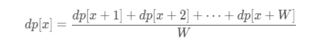
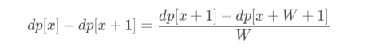
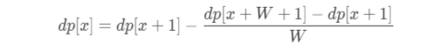
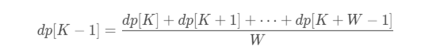
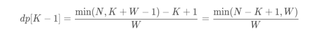

<!-- more -->


### 题目[837.新21点](https://leetcode-cn.com/problems/new-21-game/)
爱丽丝参与一个大致基于纸牌游戏 “21点” 规则的游戏，描述如下：

爱丽丝以 0 分开始，并在她的得分少于 K 分时抽取数字。 抽取时，她从 \[1, W] 的范围中随机获得一个整数作为分数进行累计，其中 W 是整数。 每次抽取都是独立的，其结果具有相同的概率。
当爱丽丝获得不少于 K 分时，她就停止抽取数字。 爱丽丝的分数不超过 N 的概率是多少？


#### 用例
输入：N = 10, K = 1, W = 10
输出：1.00000

输入：N = 6, K = 1, W = 10
输出：0.60000

输入：N = 21, K = 17, W = 10
输出：0.73278

#### 解题思路
1. 思路一
    1. 动态规划的思路，爱丽丝获胜的概率只和下一轮开始前的得分有关，因此利用得分计算概率
    2. 令 dp[x] 表示从得分为 xx 的情况开始游戏并且获胜的概率，目标是求dp[0] 的值。
    3. 根据规则，当分数达到或超过K时游戏结束，游戏结束时，如果分数不超过 N则获胜，如果分数超过N则失败。因此当K≤x≤min(N,K+W−1)时有dp[x]=1，当x>min(N,K+W−1)时有dp[x]=0。
    4. 当0≤x≤K时，如何计算dp[x]的值？注意到每次在范围[1,W] 内随机抽取一个整数，且每个整数被抽取到的概率相等，因此可以得到如下状态转移方程：
    
    5. 时间复杂度O(K*W)
2. 思路二
    1. 在上面的思路的基础上对其进行差分,考虑dp的临近项进行差分，有如下结果：
    
    其中0<=x<K-1
    2. 可以得到新的状态转移方程为：
    
    3. 当x=K-1时，需要通过
    
    4. 注意到仅有K<=x<=min(N,K+W-1)时，才有dp[x] = 1,所以
    
3. 思路三
    参考这篇博客——[新21点](https://zhuanlan.zhihu.com/p/86167813)
#### 代码
```python
class Solution:
    def new21Game(self, N: int, K: int, W: int) -> float:
        if K == 0:
            return 1.0
        dp = [0.0] * (K + W + 1)
        for i in range(K,min(N,K+W+-1)+1):
            dp[i] = 1
        for i in range(K-1,-1,-1):
            for j in range(1,W+1):
                dp[i] += dp[i+j]/W
        return dp[0]


class Solution2:
    def new21Game(self, N: int, K: int, W: int) -> float:
        if K == 0:
            return 1.0
        dp = [0.0] * (K + W + 1)
        for i in range(K, min(N, K + W - 1) + 1):
            dp[i] = 1.0
        dp[K - 1] = float(min(N - K + 1, W)) / W
        for i in range(K - 2, -1, -1):
            dp[i] = dp[i + 1] - (dp[i + W + 1] - dp[i + 1]) / W
        return dp[0]


class Solution3:
    def new21Game(self, N: int, K: int, W: int) -> float:
        if K == 0 or N >= K + W:
            return 1.0
        sums = [0.0 for i in range(K + W)]
        sums[0] = 1.0
        for i in range(1, K + W):
            t = min(i-1, K-1)
            if i <= W:
                sums[i] = sums[i - 1] + sums[t] / W
            else:
                sums[i] = sums[i - 1] + (sums[t] - sums[i - W - 1]) / W
        return (sums[N] - sums[K - 1]) / (sums[K + W - 1] - sums[K - 1])
```

### 题目[528.按权重随机选择](https://leetcode-cn.com/problems/random-pick-with-weight/)
给定一个正整数数组 w ，其中 w[i] 代表位置 i 的权重，请写一个函数 pickIndex ，它可以随机地获取位置 i，选取位置 i 的概率与 w[i] 成正比。

说明:

1 <= w.length <= 10000
1 <= w[i] <= 10^5
pickIndex 将被调用不超过 10000 次

#### 解题思路
前缀和作为加权选择

#### 代码
```python
class Solution:

    def __init__(self, w: List[int]):
        self.arr = w
        prev = 0
        self.consum = []
        for i in range(len(w)):
            prev += w[i]
            self.consum.append(prev)
        self.summary = prev

    def pickIndex(self) -> int:
        number = random.randint(1, self.summary)
        idx = bisect.bisect_left(self.consum, number)
        return idx
```

### 题目[529.扫雷游戏](https://leetcode-cn.com/problems/minesweeper/)

给定一个代表游戏板的二维字符矩阵。 'M' 代表一个未挖出的地雷，'E' 代表一个未挖出的空方块，'B' 代表没有相邻（上，下，左，右，和所有4个对角线）地雷的已挖出的空白方块，数字（'1' 到 '8'）表示有多少地雷与这块已挖出的方块相邻，'X' 则表示一个已挖出的地雷。

现在给出在所有未挖出的方块中（'M'或者'E'）的下一个点击位置（行和列索引），根据以下规则，返回相应位置被点击后对应的面板：

如果一个地雷（'M'）被挖出，游戏就结束了- 把它改为 'X'。
如果一个没有相邻地雷的空方块（'E'）被挖出，修改它为（'B'），并且所有和其相邻的方块都应该被递归地揭露。
如果一个至少与一个地雷相邻的空方块（'E'）被挖出，修改它为数字（'1'到'8'），表示相邻地雷的数量。
如果在此次点击中，若无更多方块可被揭露，则返回面板。


#### 用例
输入
```
[['E', 'E', 'E', 'E', 'E'],
 ['E', 'E', 'M', 'E', 'E'],
 ['E', 'E', 'E', 'E', 'E'],
 ['E', 'E', 'E', 'E', 'E']]

Click : [3,0]
```
输出
```
[['B', '1', 'E', '1', 'B'],
 ['B', '1', 'M', '1', 'B'],
 ['B', '1', '1', '1', 'B'],
 ['B', 'B', 'B', 'B', 'B']]
```

#### 解题思路
bfs配合一个visited数组就可以，第一个方法超时严重

#### 代码

```python
from typing import List
from collections import deque


class Solution:
    def updateBoard(self, board: List[List[str]], click: List[int]) -> List[List[str]]:
        row, col = len(board), len(board[0])
        self.dp = self.searchMine(board)
        self.visited = [[False] * col for _ in range(row)]
        ans = board.copy()
        x, y = click
        if board[x][y] == 'M':
            ans[x][y] = 'X'
            return ans
        self.dfs(board,ans,x,y)
        return ans

    def searchMine(self, board):
        row, col = len(board), len(board[0])
        dp = [[0] * col for _ in range(row)]
        for i in range(row):
            for j in range(col):
                count = 0
                for dx, dy in [(-1, -1), (-1, 0), (-1, 1), (0, -1), (0, 1), (1, -1), (1, 0), (1, 1)]:
                    if 0 <= i + dx < row and 0 <= j + dy < col and board[i + dx][j + dy] == 'M':
                        count += 1
                dp[i][j] = count
        return dp

    def dfs(self, board, ans, x, y):
        row, col = len(ans), len(ans[0])
        node = deque()
        node.append((x, y))
        while node:
            x, y = node.popleft()
            self.visited[x][y] = True
            ans[x][y] = 'B' if self.dp[x][y] == 0 else str(self.dp[x][y])
            for dx, dy in [(-1, -1), (-1, 0), (-1, 1), (0, -1), (0, 1), (1, -1), (1, 0), (1, 1)]:
                if self.dp[x][y] == 0 and 0 <= x + dx < row and 0 <= y + dy < col and not self.visited[x + dx][y + dy] and board[x + dx][y + dy] != 'M':
                    node.append((x + dx, y + dy))


a =[['E', 'E', '1', 'E', 'E'],
    ['E', 'E', 'M', 'E', 'E'],
    ['E', 'E', 'E', 'E', 'E'],
    ['E', 'E', 'E', 'E', 'E']]

k=Solution()
print(k.updateBoard(a,[3,0]))


class Solution:
    def updateBoard(self, board: List[List[str]], click: List[int]) -> List[List[str]]:
        a, b = click
        if board[a][b] == 'M':
            board[a][b] = 'X'
        elif board[a][b] == 'E':
            d = [*itertools.product((-1, 0, 1), repeat=2)]
            q, v, m, n = [(a, b)], {(a, b)}, len(board), len(board[0])
            while q:
                p = []
                for i, j in q:
                    c, t = 0, []
                    for di, dj in d:
                        x, y = i + di, j + dj
                        if 0 <= x < m and 0 <= y < n:
                            c += board[x][y] == 'M'
                            (x, y) not in v and t.append((x, y))
                    board[i][j] = c and str(c) or p.extend(t) or v.update(t) or 'B'
                q = p
        return board
```