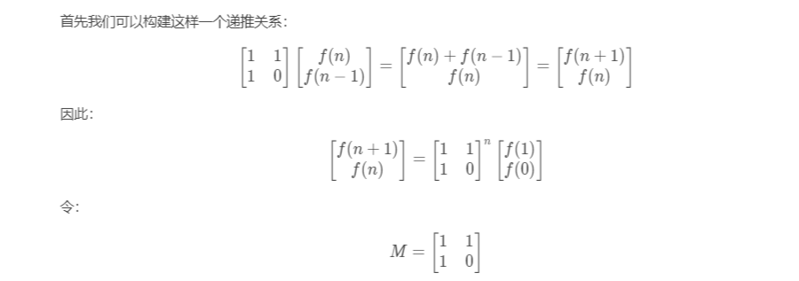
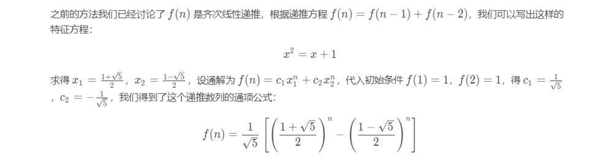

<!-- more -->

### 题目[70.爬楼梯](https://leetcode-cn.com/problems/climbing-stairs/)
假设你正在爬楼梯。需要 n 阶你才能到达楼顶。
每次你可以爬 1 或 2 个台阶。你有多少种不同的方法可以爬到楼顶呢？
注意：给定 n 是一个正整数。

#### 用例
输入： 2
输出： 2

输入： 3
输出： 3
#### 解题思路
考虑当用户最后登上最后一节台阶时，它的选择有两种：
1. 从最后一阶台阶的前一阶台阶登上
2. 从最后一阶台阶的前两阶台阶登上
3. 可以写出其dp方程为：f(x)=f(x-1)+f(x-2)

比较高级的解法——构造如下的推导矩阵：

因此只要能够快速计算出矩阵M的n次幂，就可以求解结果，用快速幂的形式

通项公式求解：


#### 代码
```java
class Solution {
    public int climbStairs(int n) {
        if (n==1) return 1;
        if (n==2) return 2;
        int prev1 = 1,prev2 = 2;
        int k = 2;
        while (k++<n){
            int tmp = prev2;
            prev2 = prev2+prev1;
            prev1 = tmp;
        }
        return prev2;
    }
}
```

快速幂的矩阵形式
```java
public class Solution {
   public int climbStairs(int n) {
       int[][] q = {{1, 1}, {1, 0}};
       int[][] res = pow(q, n);
       return res[0][0];
   }
   public int[][] pow(int[][] a, int n) {
       int[][] ret = {{1, 0}, {0, 1}};
       while (n > 0) {
           if ((n & 1) == 1) {
               ret = multiply(ret, a);
           }
           n >>= 1;
           a = multiply(a, a);
       }
       return ret;
   }
   public int[][] multiply(int[][] a, int[][] b) {
       int[][] c = new int[2][2];
       for (int i = 0; i < 2; i++) {
           for (int j = 0; j < 2; j++) {
               c[i][j] = a[i][0] * b[0][j] + a[i][1] * b[1][j];
           }
       }
       return c;
   }
}
```

```java
public class Solution {
    public int climbStairs(int n) {
        double sqrt5 = Math.sqrt(5);
        double fibn = Math.pow((1 + sqrt5) / 2, n + 1) - Math.pow((1 - sqrt5) / 2, n + 1);
        return (int)(fibn / sqrt5);
    }
}
```

### 题目[1.两数之和](https://leetcode-cn.com/problems/two-sum/)
给定一个整数数组 nums 和一个目标值 target，请你在该数组中找出和为目标值的那 两个 整数，并返回他们的数组下标。

你可以假设每种输入只会对应一个答案。但是，数组中同一个元素不能使用两遍。

#### 用例
给定 nums = [2, 7, 11, 15], target = 9
结果为：[0,1]
#### 解题思路
利用hashmap或者排序并用双指针进行求解

#### 代码
```java
class Solution {
    public int[] twoSum(int[] nums, int target) {
        Map<Integer,Integer> map = new HashMap<>();
        for (int i=0;i<nums.length;i++){
            int complement = target - nums[i];
            if (map.containsKey(complement)) {
                return new int[] {map.get(complement),i};
            }
            map.put(nums[i],i);
        }
        throw new IllegalArgumentException("No two sum solution");
    }
}
```
因为需要保存数字的位置，所以需要自己编写一个比较器
```java
class Solution{
    public int[] twoSum(int[] nums, int target) {
        int[][] objects = new int[nums.length][2];
        for (int i = 0; i < nums.length; i++) {
            objects[i] = new int[]{nums[i], i};
        }
        Arrays.sort(objects, new Comparator<int[]>() {

            @Override
            public int compare(int[] o, int[] t1) {
                return o[0] - t1[0];
            }
        });
        int left = 0;
        int right = nums.length - 1;
        while (left < right) {
            int[] leftValue =  objects[left];
            int[] rightValue =  objects[right];
            int value = leftValue[0] + rightValue[0];
            if (value == target)
                return new int[]{leftValue[1], rightValue[1]};
            else if (value < target) {
                left++;
            } else {
                right--;
            }
        }
        return new int[2];
    }
}
```

### 题目[15.三数之和](https://leetcode-cn.com/problems/3sum/)
给你一个包含 n 个整数的数组 nums，判断 nums 中是否存在三个元素 a，b，c ，使得 a + b + c = 0 ？请你找出所有满足条件且不重复的三元组。

注意：答案中不可以包含重复的三元组。
#### 用例
给定数组 nums = [-1, 0, 1, 2, -1, -4]，

满足要求的三元组集合为：
[
  [-1, 0, 1],
  [-1, -1, 2]
]

#### 解题思路
题目要求只需要求出数字组合就可以了，可以采用排序方式

#### 代码
```java
class Solution {
    public List<List<Integer>> threeSum(int[] nums) {
        List<List<Integer>> ans = new ArrayList<>();
        if (nums.length < 3) return ans;
        Arrays.sort(nums);
        for (int i = 0; i < nums.length - 2; i++) {
            if (i>0 && nums[i]==nums[i-1]) continue;;
            int left = i + 1,right = nums.length - 1;
            while (left < right){
                int summary = nums[i] + nums[left]+ nums[right];
                if (summary==0){
                    ans.add(new ArrayList<>(Arrays.asList(nums[i],nums[left],nums[right])));
                    while (left < right && nums[left] == nums[left+1]) left++;
                    while (left < right && nums[right] == nums[right-1]) right--;
                    left++;right--;
                }else if (summary>0){
                    right--;
                }else left++;
            }
        }
        return ans;
    }
}
```


### 题目[18.四数之和](https://leetcode-cn.com/problems/4sum/)
给定一个包含 n 个整数的数组 nums 和一个目标值 target，判断 nums 中是否存在四个元素 a，b，c 和 d ，使得 a + b + c + d 的值与 target 相等？找出所有满足条件且不重复的四元组。

#### 用例
给定数组 nums = [1, 0, -1, 0, -2, 2]，和 target = 0。

满足要求的四元组集合为：
[
  [-1,  0, 0, 1],
  [-2, -1, 1, 2],
  [-2,  0, 0, 2]
]

#### 解题思路
排序并结合上面题目的思路进行分析

#### 代码
```java
class Solution {
    public List<List<Integer>> fourSum(int[] nums, int target) {
        int length = nums.length;
        List<List<Integer>> ans = new ArrayList<>();
        if (length < 4) return ans;
        Arrays.sort(nums);
        for (int i = 0; i < length - 3; i++) {
            if (i > 0 && nums[i] == nums[i - 1]) continue;
            if (nums[i] + nums[i + 1] + nums[i + 2] + nums[i + 3] > target) break;
            if (nums[i] + nums[length - 1] + nums[length - 2] + nums[length - 3] < target) continue;
            for (int j = i + 1; j < length - 2; j++) {
                if (j > i + 1 && nums[j] == nums[j - 1]) continue;
                if (nums[j] + nums[j + 1] + nums[j + 2] + nums[i] > target) break;
                if (nums[j] + nums[i] + nums[length - 1] + nums[length - 2] < target) continue;
                int left = j + 1, right = length - 1;
                while (left < right) {
                    int summary = nums[i] + nums[j] + nums[left] + nums[right];
                    if (summary == target) {
                        ans.add(new ArrayList<>(Arrays.asList(nums[i], nums[j], nums[left], nums[right])));
                        while (left < right && nums[left] == nums[left + 1]) left++;
                        while (left < right && nums[right] == nums[right - 1]) right--;
                        left++;right--;
                    }else if (summary>target){
                        right--;
                        while (left<right && nums[right]==nums[right+1])right--;
                    }else {
                        left++;
                        while (left<right && nums[left]==nums[left-1])left++;
                    }
                }
            }
        }
        return ans;
    }
}
```